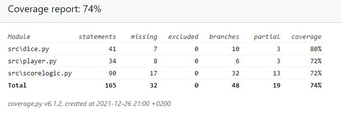

# Testausdokumentti

## Yleistä

Ohjelman testaus on toteutettu unittest-frameworkilla, ja devauksen aikana 
kaikkien rakastamalla print-debuggauksella.

## Testauskattavuus

Coverage-reportilla suoritetun laskelman mukaan testauksen haarautumakattavuus on silmää miellyttävä 74%.
Tästä on jätetty pois käyttöliittymä sekä testaustiedostot. Testausta olisi toki voinut laajentaa 
suuremman haarautumakattavuuden saavuttamiseksi, mutta tietokantojen ja käyttäjäkirjautumisten
loistaessa poissaoloaan se olisi melko turhaa, sillä realistisesti hyödyllistä testattavaa ei juurikaan ole.

## Järjestelmätestaus

Järjestelmätestaus on suoritettu manuaalisesti useammalla Windows-tietokoneella, sekä kahdella Linuxilla.
Kaikki eri tilanteet ovat testattu, ja virheelliset syötteet ovat estetty kaikissa tilanteissa.

## Sovelluksen laatuongelmat

Ekstensiivisen manuaalitestaamiseni mukaan sovellukseen ei ole jäänyt laatuongelmia, mutta luen
mielelläni issueista ja korjaan jos semmoisia joku onnistuu löytämään.